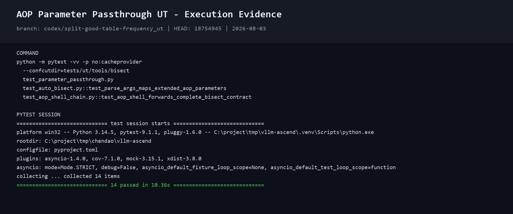
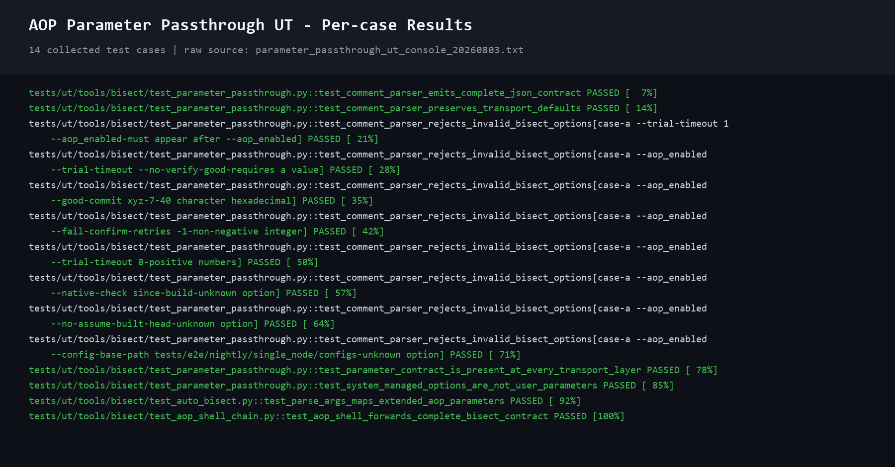

# AOP 二分参数透传专项 UT 报告

## 1. 被测功能与范围

本报告只验证 AOP 二分参数透传功能，不评价 good table、环境切换、候选提交算法、构建决策、verdict 或二分收敛逻辑。

被测链路：

```text
PR 评论 /nightly 或 /weekly
  -> pr_nightly_command.yml 从左到右解析 token
  -> 校验并生成 bisect_args_json
  -> schedule workflow 解包 JSON
  -> reusable workflow / Pod env / AOP Shell 逐层传递
  -> aop_process.sh 组装 auto_bisect argv
  -> tools.bisect.auto_bisect argparse 接收最终参数
```

用户可配置的 8 个参数：

| 评论参数 | JSON key | 最终 CLI |
|---|---|---|
| `--good-commit` | `good_commit` | `--good-commit` |
| `--bad-commit` | `bad_commit` | `--bad-commit` |
| `--fail-confirm-retries` | `fail_confirm_retries` | `--fail-confirm-retries` |
| `--trial-timeout` | `trial_timeout` | `--trial-timeout-s` |
| `--barrier-timeout` | `barrier_timeout` | `--barrier-timeout-s` |
| `--no-verify-good` | `no_verify_good` | `--no-verify-good` |
| `--no-verify-bad` | `no_verify_bad` | `--no-verify-bad` |
| `--force-initial-build` | `force_initial_build` | `--force-initial-build` |

系统内部管理且不允许用户在评论命令中配置：

- `--native-check`
- `--no-assume-built-head`
- `--config-base-path`

## 2. UT 设计思路

参数透传的主要风险不是计算错误，而是长链路中出现字段遗漏、重命名、默认值变化、字符串与 Boolean 类型变化、Shell 拆词，或者把内部参数错误暴露给用户。因此专项 UT 分为四层：

1. **评论解析层**：真实提取并执行 `pr_nightly_command.yml` 中的生产 Bash 解析脚本，检查完整输入、默认输入和非法输入。
2. **静态协议层**：逐字段检查 schedule、reusable workflow、LWS 模板、Shell 和 argparse，确认同一参数在所有传输层存在且映射一致。
3. **最终 CLI 层**：调用真实 `_parse_args`，确认 AOP 参数能转换为 `auto_bisect` 的最终字段和值。
4. **AOP Shell 执行层**：使用 Git for Windows Bash 真实运行 `aop_process.sh`，以 fake Python 捕获最终 argv，验证参数边界和值没有丢失。

## 3. 执行环境与命令

| 项目 | 值 |
|---|---|
| 执行日期 | 2026-08-03（Asia/Shanghai） |
| 仓库 | `C:\project\tmp\chendao\vllm-ascend` |
| 分支 | `codex/split-good-table-frequency_ut` |
| 被测 HEAD | `18754945` |
| 系统 | Windows 10 |
| Python | 3.14.5 |
| pytest | 9.1.1 |

执行命令：

```powershell
python -m pytest -vv -p no:cacheprovider `
  --confcutdir=tests/ut/tools/bisect `
  tests/ut/tools/bisect/test_parameter_passthrough.py `
  tests/ut/tools/bisect/test_auto_bisect.py::test_parse_args_maps_extended_aop_parameters `
  tests/ut/tools/bisect/test_aop_shell_chain.py::test_aop_shell_forwards_complete_bisect_contract
```

执行结果：

```text
collected 14 items
14 passed in 10.36s
```

原始控制台日志保存在
[`test_evidence/parameter_passthrough_ut_console_20260803.txt`](./test_evidence/parameter_passthrough_ut_console_20260803.txt)，报告中的结果截图由该日志生成。

### 3.1 实际执行步骤

1. 进入 `_ut` 分支仓库并确认被测 HEAD 为 `18754945`。
2. 使用 `--confcutdir=tests/ut/tools/bisect` 隔离与本专项无关的顶层 NPU/Torch fixture。
3. 显式选择 `test_parameter_passthrough.py`，只运行评论解析、默认值、异常校验和跨层协议检查。
4. 单独选择 `test_parse_args_maps_extended_aop_parameters`，验证透传结束后的真实 argparse 结果。
5. 单独选择 `test_aop_shell_forwards_complete_bisect_contract`，通过 Git Bash 执行生产 `aop_process.sh`；脚本内部调用 fake Python，记录并断言最终 argv。
6. pytest 收集 14 个参数化展开项，逐项执行，最终返回码为 0。

执行命令、Python/pytest版本、收集数量和最终结果截图：



14个用例逐项执行结果截图：



## 4. 逐项过程与结果

以下 14 项是 pytest 参数化展开后的实际执行项。

| # | 测试项 | 测试过程 | 预期结果 | 实际结果 |
|---:|---|---|---|---|
| 1 | 完整评论参数生成 JSON | 执行生产评论解析脚本，输入 good/bad、重试、两个超时、两个端点开关和首次构建开关 | 8 个字段全部进入 `bisect_args_json`，字符串和 Boolean 类型正确 | PASS |
| 2 | 无可选参数保持默认值 | 输入 `case-a --aop_enabled` | good 为空、bad 为 `HEAD`、可选数字为空、三个 flag 为 `false` | PASS |
| 3 | 二分参数位于 AOP 开关前 | 输入 `case-a --trial-timeout 1 --aop_enabled` | 拒绝并报告参数必须位于 `--aop_enabled` 后 | PASS |
| 4 | 值参数缺值 | 输入 `case-a --aop_enabled --trial-timeout --no-verify-good` | 拒绝并报告 `--trial-timeout requires a value` | PASS |
| 5 | good commit 格式非法 | 输入 `--good-commit xyz` | 拒绝非 7～40 位十六进制 SHA | PASS |
| 6 | retry 为负数 | 输入 `--fail-confirm-retries -1` | 拒绝非负整数以外的值 | PASS |
| 7 | timeout 为零 | 输入 `--trial-timeout 0` | 拒绝非正数 | PASS |
| 8 | 用户传入 `--native-check` | 在评论命令中传内部参数 | 按未知参数拒绝，不进入 JSON | PASS |
| 9 | 用户传入 `--no-assume-built-head` | 在评论命令中传内部参数 | 按未知参数拒绝，不进入 JSON | PASS |
| 10 | 用户传入 `--config-base-path` | 在评论命令中传内部参数 | 按未知参数拒绝，不进入 JSON | PASS |
| 11 | 跨传输层字段契约 | 对 6 个 schedule、5 个 reusable workflow、LWS、Shell 和 argparse 逐字段扫描 | 8 个用户参数在每层均存在，JSON/input/env/CLI 命名映射一致 | PASS |
| 12 | 系统管理参数隔离 | 检查评论协议、JSON、Workflow 和 AOP Shell | 三个内部参数不向用户暴露；native 策略固定，配置路径只由系统传递 | PASS |
| 13 | `auto_bisect` 最终解析 | 直接向真实 `_parse_args` 传递完整 AOP CLI 参数 | 最终 Namespace 中所有参数的值和类型正确 | PASS |
| 14 | AOP Shell 完整透传 | 使用 Git Bash 真实运行 `aop_process.sh`，fake Python 捕获 update-table 与 auto-bisect argv | 用户8参数、good/env table、内部配置路径和固定 native 策略无丢失、无拆词 | PASS |

## 5. 结论

本次参数透传专项 UT 共 14 项，14 项全部通过。仓库内可控链路已经验证：

- 评论层能正确解析、校验和拒绝非法参数；
- 不传新增参数时保持约定默认值；
- 8 个用户参数能进入 JSON 并在所有传输层保持字段一致；
- 3 个系统管理参数不会暴露给评论用户；
- AOP Shell 能把参数组装为 `auto_bisect` 最终 CLI；
- 底层 argparse 能接收正确的值与类型。

## 6. 尚未覆盖的边界

以下内容不应写成“UT 已验证”，需要 GitHub Actions 或 NPU 环境验证：

- GitHub 上真实 slash-command 事件到 `workflow_dispatch` 的网络调用；
- Actions 表达式 `fromJSON` 在真实 runner 中的求值；
- 参数进入真实 single-node Pod 和 multi-node LWS Pod 后的环境变量值；
- 真实 NPU case 失败后触发 AOP 并执行二分的物理闭环。

这些属于集成/E2E边界，不影响本报告对仓库内参数解析和透传协议的 UT 结论。
