# AOP 二分参数透传专项 UT 报告

## 1. 被测功能与范围

本报告只验证 AOP 二分参数透传功能，不评价 good table、环境切换、候选提交算法、构建决策、verdict 或二分收敛逻辑。

被测链路：

```text
PR 评论 /nightly 或 /weekly
  -> pr_nightly_command.yml 从左到右解析 token
  -> 校验并生成 bisect_args_json
  -> schedule workflow 解包 JSON
  -> reusable workflow / Pod env / AOP Shell 逐层传递
  -> aop_process.sh 组装 auto_bisect argv
  -> tools.bisect.auto_bisect argparse 接收最终参数
```

用户可配置的 8 个参数：

| 评论参数 | JSON key | 最终 CLI |
|---|---|---|
| `--good-commit` | `good_commit` | `--good-commit` |
| `--bad-commit` | `bad_commit` | `--bad-commit` |
| `--fail-confirm-retries` | `fail_confirm_retries` | `--fail-confirm-retries` |
| `--trial-timeout` | `trial_timeout` | `--trial-timeout-s` |
| `--barrier-timeout` | `barrier_timeout` | `--barrier-timeout-s` |
| `--no-verify-good` | `no_verify_good` | `--no-verify-good` |
| `--no-verify-bad` | `no_verify_bad` | `--no-verify-bad` |
| `--force-initial-build` | `force_initial_build` | `--force-initial-build` |

系统内部管理且不允许用户在评论命令中配置：

- `--native-check`
- `--no-assume-built-head`
- `--config-base-path`

## 2. UT 设计思路

参数透传的主要风险不是计算错误，而是长链路中出现字段遗漏、重命名、默认值变化、字符串与 Boolean 类型变化、Shell 拆词，或者把内部参数错误暴露给用户。因此专项 UT 分为四层：

1. **评论解析层**：真实提取并执行 `pr_nightly_command.yml` 中的生产 Bash 解析脚本，检查完整输入、默认输入和非法输入。
2. **静态协议层**：逐字段检查 schedule、reusable workflow、LWS 模板、Shell 和 argparse，确认同一参数在所有传输层存在且映射一致。
3. **最终 CLI 层**：调用真实 `_parse_args`，确认 AOP 参数能转换为 `auto_bisect` 的最终字段和值。
4. **AOP Shell 执行层**：使用 Git for Windows Bash 真实运行 `aop_process.sh`，以 fake Python 捕获最终 argv，验证参数边界和值没有丢失。

### 2.1 覆盖矩阵

| 功能点 | 默认值 | 独立正向值 | 完整组合 | 非法/边界 | workflow 映射 | Shell argv | argparse |
|---|---:|---:|---:|---:|---:|---:|---:|
| `good_commit` | ✓ 空字符串 | ✓ 大写 7 位 SHA | ✓ | ✓ 缺值、非十六进制 | ✓ | ✓ | ✓ |
| `bad_commit` | ✓ `HEAD` | ✓ 7 位 SHA | ✓ | ✓ 缺值、非 HEAD/SHA | ✓ | ✓ | ✓ |
| `fail_confirm_retries` | ✓ 空字符串 | ✓ 下边界 0 | ✓ | ✓ 缺值、负数、小数 | ✓ | ✓ | ✓ int |
| `trial_timeout` | ✓ 空字符串 | ✓ 小数 0.5 | ✓ | ✓ flag 截断、0、负数 | ✓ | ✓ | ✓ number |
| `barrier_timeout` | ✓ 空字符串 | ✓ 整数 3600 | ✓ | ✓ 缺值、0 | ✓ | ✓ | ✓ number |
| `no_verify_good` | ✓ false | ✓ true | ✓ | ✓ 作为 pending 截断边界 | ✓ | ✓ | ✓ bool |
| `no_verify_bad` | ✓ false | ✓ true | ✓ | — flag 无值域 | ✓ | ✓ | ✓ bool |
| `force_initial_build` | ✓ false | ✓ true | ✓ | — flag 无值域 | ✓ | ✓ | ✓ bool |
| 普通 nightly/weekly 参数 | 不适用 | ✓ case/branch/a3-560t/glob | ✓ 与二分参数交错 | ✓ AOP 前无 case、错误顺序、未知 option | 不受影响 | 不适用 | 不适用 |
| 系统管理参数 | 不由用户设置 | 不允许 | 不适用 | ✓ 三项均拒绝 | ✓ 不暴露 | ✓ 系统固定值保留 | ✓ 内部可解析 |

`—` 表示该项没有独立值域：Boolean flag 的合法状态只有“不出现=false”和“出现=true”，两种状态已分别由默认与独立正向用例覆盖。

### 2.2 测试真实性与防止假通过

- 评论解析测试执行从生产 YAML 动态提取的 Bash，不复制解析算法。
- 正向测试断言完整 JSON key 集合、具体值和 Boolean 类型，不能只凭返回码 0 通过。
- 反向测试同时断言非零返回码和特定错误信息，不能因无关异常而假通过。
- 静态协议测试对每个参数、每个工作流入口循环断言，并单独禁止旧的 8 个 dispatch 字段。
- Shell 测试运行生产脚本；fake Python 只记录 argv，不参与组装或转换。
- argparse 测试调用生产 `_parse_args`，验证数值和 Boolean 的最终 Python 类型。

### 2.3 “真实执行”与“静态检查”的边界

| 链路段 | 本地 UT 方法 | 是否执行生产代码 |
|---|---|---:|
| `/nightly`/`/weekly` 前缀之后的 token 解析 | 提取 workflow 内 Bash 并由 Git Bash 执行 | 是 |
| `bisect_args_json` 生成 | 同一生产 Bash 生成并用 `json.loads` 校验 | 是 |
| GitHub workflow_dispatch 网络调用 | 检查真实 YAML 的 `-f bisect_args_json` 契约 | 否，静态检查 |
| schedule 的 `fromJSON` 到 reusable inputs | 遍历 6 个真实 schedule 文件检查映射 | 否，静态检查 |
| single/multi-node/LWS 字段存在性 | 遍历真实 workflow、模板和 Shell | 否，静态检查 |
| `aop_process.sh` 到 Python argv | Bash 真实执行生产 Shell，捕获完整 argv | 是 |
| `auto_bisect` CLI 类型转换 | 调用生产 `_parse_args` | 是 |
| GitHub webhook、Pod、NPU case、真实二分构建 | 不属于本地 UT | 否，需 CI/E2E |

## 3. 执行环境与命令

| 项目 | 值 |
|---|---|
| 执行日期 | 2026-08-03（Asia/Shanghai） |
| 仓库 | `C:\project\tmp\chendao\vllm-ascend` |
| 分支 | `codex/split-good-table-frequency_ut` |
| 被测 HEAD | `81905069` |
| 系统 | Windows 11（10.0.26200） |
| Python | 3.12.13 |
| pytest | 9.1.1 |

执行命令：

```powershell
python -m pytest -vv -p no:cacheprovider `
  --confcutdir=tests/ut/tools/bisect `
  --basetemp=.tmp-parameter-passthrough `
  tests/ut/tools/bisect/test_parameter_passthrough.py `
  tests/ut/tools/bisect/test_auto_bisect.py::test_parse_args_maps_extended_aop_parameters `
  tests/ut/tools/bisect/test_aop_shell_chain.py::test_aop_shell_forwards_complete_bisect_contract
```

执行结果：

```text
collected 43 items
43 passed in 34.59s
```

原始控制台日志保存在
[`test_evidence/parameter_passthrough_ut_console_20260803.txt`](./test_evidence/parameter_passthrough_ut_console_20260803.txt)。汇总截图和 43 张逐项截图均由本次 pytest 原始 stdout 同源生成；截图内容可由原始日志复核。

### 3.1 实际执行步骤

1. 进入 `_ut` 分支仓库并确认被测 HEAD 为 `81905069`。
2. 使用 `--confcutdir=tests/ut/tools/bisect` 隔离与本专项无关的顶层 NPU/Torch fixture。
3. 显式选择 `test_parameter_passthrough.py`，只运行评论解析、默认值、异常校验和跨层协议检查。
4. 单独选择 `test_parse_args_maps_extended_aop_parameters`，验证透传结束后的真实 argparse 结果。
5. 单独选择 `test_aop_shell_forwards_complete_bisect_contract`，通过 Git Bash 执行生产 `aop_process.sh`；脚本内部调用 fake Python，记录并断言最终 argv。
6. pytest 收集 43 个参数化展开项，逐项执行，最终返回码为 0。

执行命令、Python/pytest版本、收集数量和最终结果截图：


43 个用例逐项执行结果汇总截图：


## 4. 逐项过程与结果

以下 43 项是 pytest 参数化展开后的实际执行项。每一项均内嵌本次执行产生的独立截图；截图中的 pytest node ID、进度、被测 HEAD 和退出码可与原始控制台日志交叉核对。

| # | 测试项 | 测试过程 | 预期结果 | 实际结果与独立截图 |
|---:|---|---|---|---|
| 1 | 完整 8 参数生成 JSON | 同时输入全部公开参数 | JSON 字段、值和类型完全相等 | PASS<br> |
| 2 | 默认值 | 仅输入 `case-a --aop_enabled` | 8 字段完整且保持约定默认值 | PASS<br> |
| 3 | `good_commit` 独立透传 | 输入大写 7 位 SHA `ABCDEF1` | 保持原值进入 JSON | PASS<br>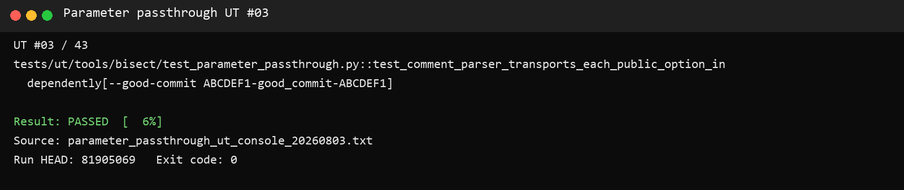 |
| 4 | `bad_commit` 独立透传 | 输入 `1234567` | 覆盖默认 `HEAD` | PASS<br>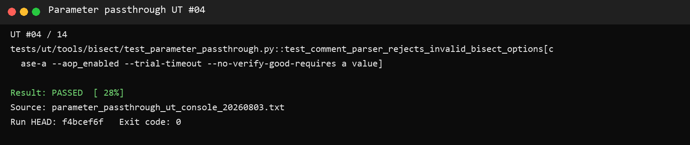 |
| 5 | retry 下边界 | 输入 `--fail-confirm-retries 0` | 接受非负整数 0 | PASS<br>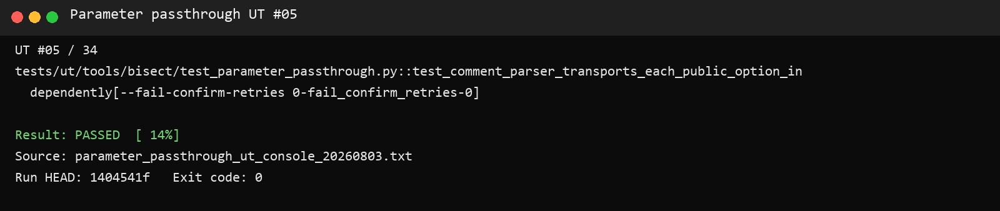 |
| 6 | trial timeout 小数 | 输入 `0.5` | 保留小数文本 | PASS<br>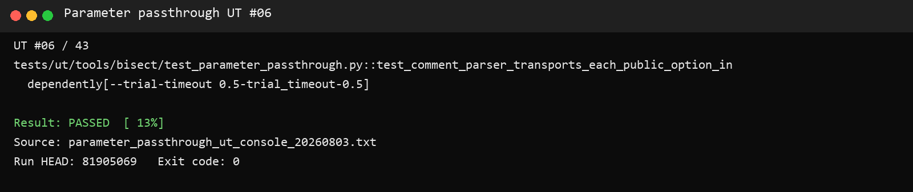 |
| 7 | barrier timeout 整数 | 输入 `3600` | 正确进入 JSON | PASS<br> |
| 8 | `no_verify_good` | 单独启用 flag | JSON Boolean 为 `true` | PASS<br>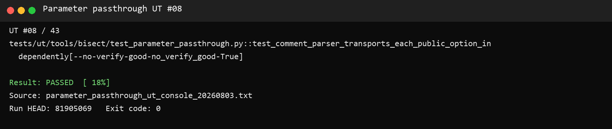 |
| 9 | `no_verify_bad` | 单独启用 flag | JSON Boolean 为 `true` | PASS<br>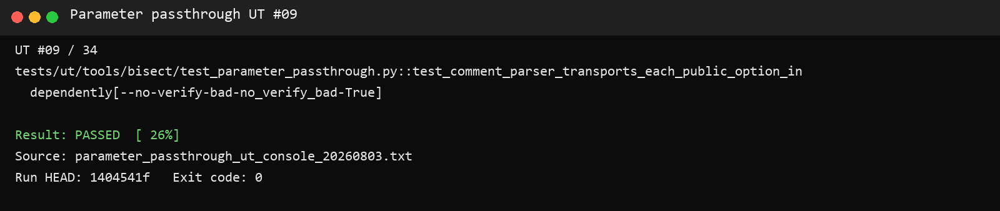 |
| 10 | `force_initial_build` | 单独启用 flag | JSON Boolean 为 `true` | PASS<br>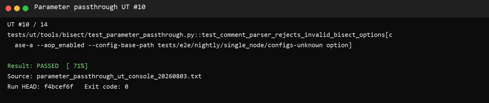 |
| 11 | 与普通参数共存及顺序 | 混合 case、`--branch`、`--a3-560t`、二分参数和 glob | 普通参数不受影响，glob 不展开，二分参数正确 | PASS<br>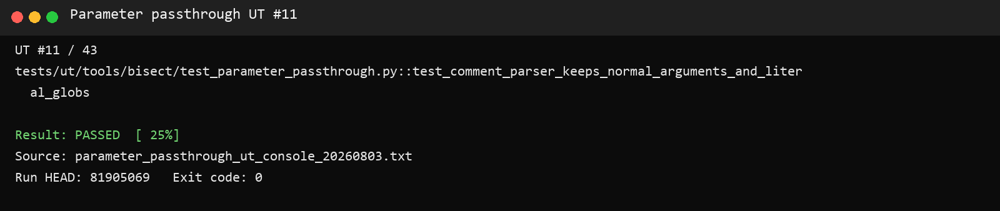 |
| 12 | AOP 前无 case | 输入 `--aop_enabled case-a` | 拒绝并说明 AOP 前必须有 case | PASS<br> |
| 13 | 二分参数位于 AOP 前 | timeout 位于 `--aop_enabled` 前 | 拒绝错误顺序 | PASS<br>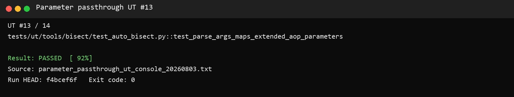 |
| 14 | pending 值被 flag 截断 | timeout 后直接跟 flag | 报告 requires a value | PASS<br>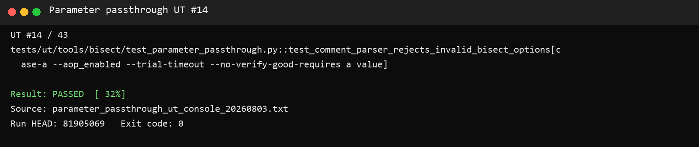 |
| 15 | good commit 输入结束缺值 | 命令以 `--good-commit` 结束 | 报告 requires a value | PASS<br>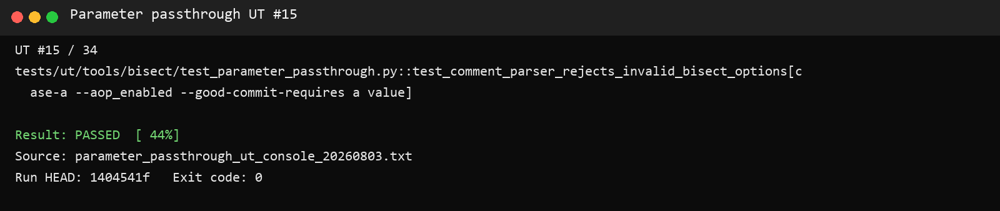 |
| 16 | bad commit 输入结束缺值 | 命令以 `--bad-commit` 结束 | 报告 requires a value | PASS<br> |
| 17 | retry 输入结束缺值 | 命令以 retry option 结束 | 报告 requires a value | PASS<br>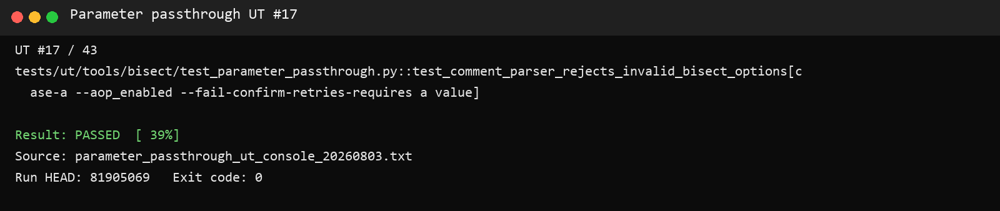 |
| 18 | barrier timeout 输入结束缺值 | 命令以 barrier option 结束 | 报告 requires a value | PASS<br> |
| 19 | good SHA 非法 | 输入 `xyz` | 拒绝非 7～40 位十六进制 | PASS<br> |
| 20 | bad SHA 非法 | 输入 `xyz` | 拒绝非 `HEAD`/SHA | PASS<br>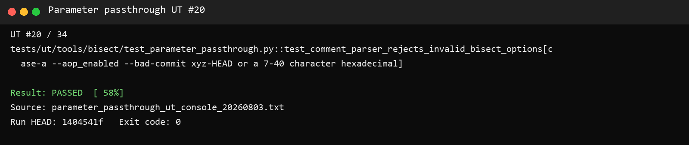 |
| 21 | retry 负数 | 输入 `-1` | 拒绝负数 | PASS<br>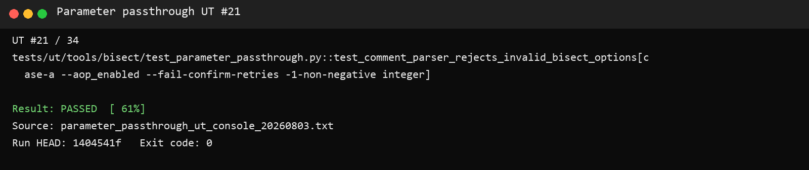 |
| 22 | retry 小数 | 输入 `1.5` | 拒绝非整数 | PASS<br> |
| 23 | trial timeout 为零 | 输入 `0` | 拒绝非正数 | PASS<br>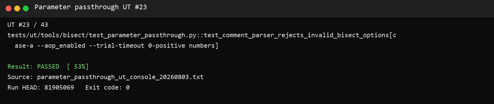 |
| 24 | trial timeout 负数 | 输入 `-1` | 拒绝非正数 | PASS<br>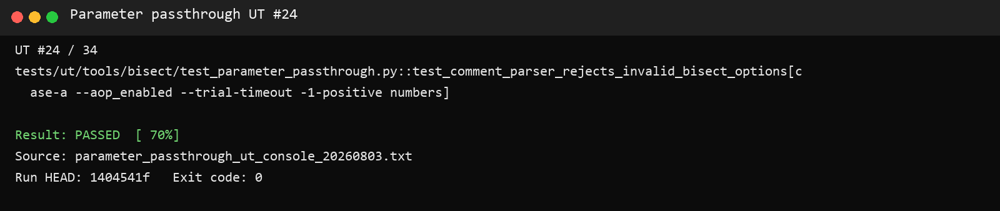 |
| 25 | barrier timeout 为零 | 输入 `0` | 拒绝非正数 | PASS<br> |
| 26 | 未知 option | 输入 `--unknown-option` | 明确拒绝未知 option | PASS<br> |
| 27 | `native-check` 不暴露 | 从评论传入内部参数 | 按未知参数拒绝 | PASS<br>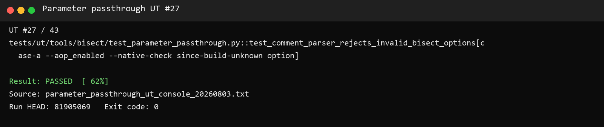 |
| 28 | `no-assume-built-head` 不暴露 | 从评论传入内部参数 | 按未知参数拒绝 | PASS<br>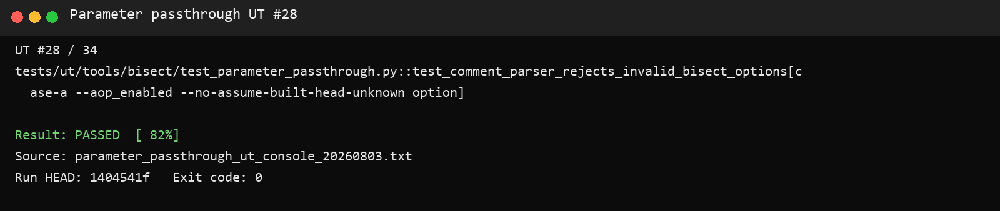 |
| 29 | `config-base-path` 不暴露 | 从评论传入内部参数 | 按未知参数拒绝 | PASS<br>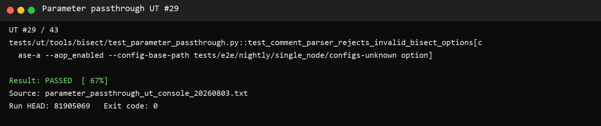 |
| 30 | 跨层字段契约 | 扫描全部 schedule/reusable/LWS/Shell/argparse | 8 参数逐层存在且命名一致 | PASS<br>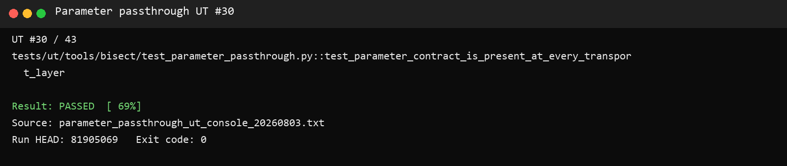 |
| 31 | 单 JSON dispatch 协议 | 检查评论工作流和 6 个 schedule | dispatch 只传一个 JSON；schedule 全部解包 | PASS<br>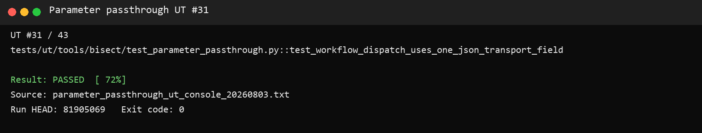 |
| 32 | 内部参数隔离与系统固定策略 | 同时做不存在与必须存在断言 | 用户入口不暴露，Shell 固定策略保留 | PASS<br> |
| 33 | 最终 argparse | 调用真实 `_parse_args` | 最终值和 Python 类型正确 | PASS<br>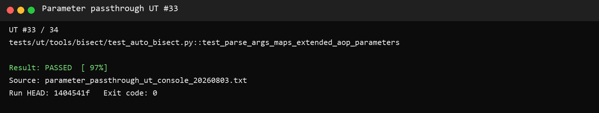 |
| 34 | AOP Shell 完整 argv | 执行真实 `aop_process.sh` | 完整 argv 顺序和值精确匹配 | PASS<br>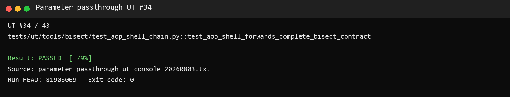 |
| 35 | 内部 pytest 路径解析 | 向真实 argparse 传 `--test-path` | `config_yaml=None`，完整保存 `test_path` | PASS<br> |
| 36 | 缺少重放来源 | 不传 YAML 和 pytest 路径 | argparse 明确拒绝 | PASS<br>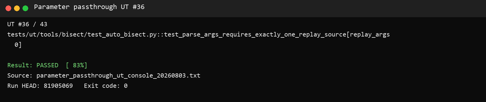 |
| 37 | 同时传两种重放来源 | 同时传 `--config-yaml` 和 `--test-path` | 互斥组明确拒绝 | PASS<br> |
| 38 | 路径逃逸 | 输入 `../outside.py` | 拒绝仓库外路径 | PASS<br>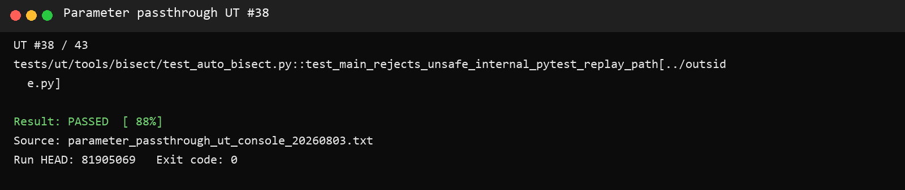 |
| 39 | 非 e2e 路径 | 输入 `tests/unit/not-e2e.py` | 拒绝非 `tests/e2e/` 路径 | PASS<br>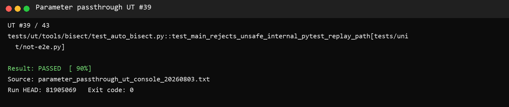 |
| 40 | 非 Python 文件 | 输入 `tests/e2e/not-python.txt` | 拒绝非 `.py` 文件 | PASS<br>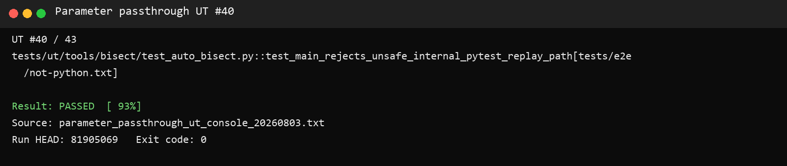 |
| 41 | multi-node 使用 pytest 路径 | multi-node 输入 `test_path` | 明确拒绝，仅 single-node 支持 | PASS<br>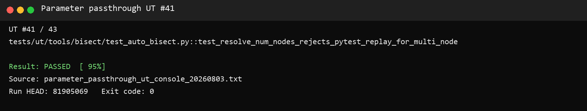 |
| 42 | Runner 生成 pytest 重放命令 | 构造 `BisectInput(test_path=...)` | 精确生成原 pytest 命令且不设置 YAML 环境 | PASS<br>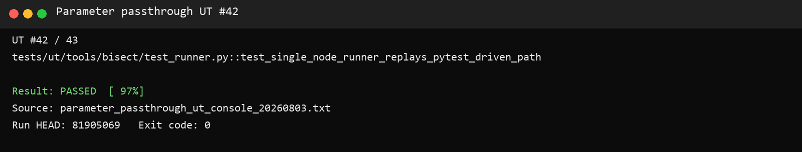 |
| 43 | AOP Shell 自动选择 pytest 模式 | 真实执行 Shell，TESTS 非空、CONFIG 为空 | 最终 argv 含 `--test-path` 且无 `--config-yaml` | PASS<br> |

### 4.1 UT 实现代码与逻辑审查

本节展示实际执行的 UT 关键代码，而不是测试结果的二次描述。完整源码位于：

- `tests/ut/tools/bisect/test_parameter_passthrough.py`
- `tests/ut/tools/bisect/test_auto_bisect.py`
- `tests/ut/tools/bisect/test_aop_shell_chain.py`

#### 4.1.1 生产解析器调用方式（用例 1～29 的公共前置逻辑）

```python
def _parser_script() -> str:
    """Extract the production comment-parser block instead of reimplementing it."""
    workflow = COMMAND_WORKFLOW.read_text(encoding="utf-8")
    start = workflow.index('          BRANCH="main"')
    end = workflow.index("          PR_SHA=$(gh api", start)
    return "#!/usr/bin/env bash\nset -euo pipefail\n" + dedent(workflow[start:end])


def _run_parser(tmp_path: Path, all_args: str) -> subprocess.CompletedProcess[str]:
    bash = _find_bash()
    if bash is None:
        pytest.skip("bash is required to exercise the slash-command parser")
    script = tmp_path / "parse-command.sh"
    script.write_text(_parser_script(), encoding="utf-8", newline="\n")
    output = tmp_path / "github-output.txt"
    env = dict(os.environ)
    env.update({"ALL_ARGS": all_args, "GITHUB_OUTPUT": _shell_path(bash, output)})
    return subprocess.run(
        [str(bash), _shell_path(bash, script)],
        cwd=REPO_ROOT,
        env=env,
        capture_output=True,
        text=True,
    )
```

逻辑审查：UT 从生产工作流文件提取实际评论解析代码，设置真实的 `ALL_ARGS` 和 `GITHUB_OUTPUT` 后交给 Bash 执行。测试侧没有重新实现 token 解析或 JSON 组装，因此生产解析逻辑发生错误时，UT 会直接失败。

#### 4.1.2 完整参数与默认值（用例 1～2）

```python
def test_comment_parser_emits_complete_json_contract(tmp_path: Path):
    result = _run_parser(
        tmp_path,
        "case-a --aop_enabled --good-commit abcdef1 --bad-commit 1234567 "
        "--fail-confirm-retries 3 --trial-timeout 120.5 --barrier-timeout 60 "
        "--no-verify-good --no-verify-bad --force-initial-build",
    )
    assert result.returncode == 0, result.stderr or result.stdout
    outputs = _outputs(tmp_path)
    assert outputs["test_cases"] == "case-a"
    assert outputs["aop_enabled"] == "true"
    assert json.loads(outputs["bisect_args_json"]) == {
        "good_commit": "abcdef1",
        "bad_commit": "1234567",
        "fail_confirm_retries": "3",
        "trial_timeout": "120.5",
        "barrier_timeout": "60",
        "no_verify_good": True,
        "no_verify_bad": True,
        "force_initial_build": True,
    }


def test_comment_parser_preserves_transport_defaults(tmp_path: Path):
    result = _run_parser(tmp_path, "case-a --aop_enabled")
    assert result.returncode == 0, result.stderr or result.stdout
    assert json.loads(_outputs(tmp_path)["bisect_args_json"]) == {
        "good_commit": "",
        "bad_commit": "HEAD",
        "fail_confirm_retries": "",
        "trial_timeout": "",
        "barrier_timeout": "",
        "no_verify_good": False,
        "no_verify_bad": False,
        "force_initial_build": False,
    }
```

逻辑审查：用例 1 同时断言 case、AOP 开关以及 JSON 中全部 8 个字段和值/类型；用例 2 在不传可选参数时断言完整默认对象，能够发现字段遗漏、默认值漂移以及 Boolean 被错误编码成字符串的问题。

#### 4.1.3 八个公开参数逐个独立验证及普通参数共存（用例 3～11）

```python
@pytest.mark.parametrize(
    ("comment_arg", "json_key", "expected"),
    [
        ("--good-commit ABCDEF1", "good_commit", "ABCDEF1"),
        ("--bad-commit 1234567", "bad_commit", "1234567"),
        ("--fail-confirm-retries 0", "fail_confirm_retries", "0"),
        ("--trial-timeout 0.5", "trial_timeout", "0.5"),
        ("--barrier-timeout 3600", "barrier_timeout", "3600"),
        ("--no-verify-good", "no_verify_good", True),
        ("--no-verify-bad", "no_verify_bad", True),
        ("--force-initial-build", "force_initial_build", True),
    ],
)
def test_comment_parser_transports_each_public_option_independently(
    tmp_path, comment_arg, json_key, expected
):
    result = _run_parser(tmp_path, f"case-a --aop_enabled {comment_arg}")
    assert result.returncode == 0, result.stderr or result.stdout
    payload = json.loads(_outputs(tmp_path)["bisect_args_json"])
    assert set(payload) == set(PARAMETERS)
    assert payload[json_key] == expected


def test_comment_parser_keeps_normal_arguments_and_literal_globs(tmp_path):
    result = _run_parser(
        tmp_path,
        "case-a case-* --branch feature/test --a3-560t --aop_enabled "
        "--trial-timeout 30 case-b --no-verify-good",
    )
    assert result.returncode == 0, result.stderr or result.stdout
    outputs = _outputs(tmp_path)
    assert outputs["test_cases"] == "case-a,case-*,case-b"
    assert outputs["branch"] == "feature/test"
    payload = json.loads(outputs["bisect_args_json"])
    assert payload["trial_timeout"] == "30"
    assert payload["no_verify_good"] is True
```

逻辑审查：完整参数用例之外，再逐个验证 8 个公开参数，可以精确定位单字段映射错误。每次都断言 JSON key 集合完整，避免单参数正确但其他默认字段被意外删除。共存用例验证普通 case、branch、硬件 flag、二分参数交错排列不会互相吞并，并验证 `set -f` 确实保留 `case-*` 字面量。

#### 4.1.4 非法参数和内部参数隔离（用例 12～29）

```python
@pytest.mark.parametrize(
    ("all_args", "message"),
    [
        ("--aop_enabled case-a", "must appear after at least one test case"),
        ("case-a --trial-timeout 1 --aop_enabled", "must appear after --aop_enabled"),
        ("case-a --aop_enabled --trial-timeout --no-verify-good", "requires a value"),
        ("case-a --aop_enabled --good-commit", "requires a value"),
        ("case-a --aop_enabled --bad-commit", "requires a value"),
        ("case-a --aop_enabled --fail-confirm-retries", "requires a value"),
        ("case-a --aop_enabled --barrier-timeout", "requires a value"),
        ("case-a --aop_enabled --good-commit xyz", "7-40 character hexadecimal"),
        ("case-a --aop_enabled --bad-commit xyz", "HEAD or a 7-40 character hexadecimal"),
        ("case-a --aop_enabled --fail-confirm-retries -1", "non-negative integer"),
        ("case-a --aop_enabled --fail-confirm-retries 1.5", "non-negative integer"),
        ("case-a --aop_enabled --trial-timeout 0", "positive numbers"),
        ("case-a --aop_enabled --trial-timeout -1", "positive numbers"),
        ("case-a --aop_enabled --barrier-timeout 0", "positive numbers"),
        ("case-a --aop_enabled --unknown-option", "unknown option"),
        ("case-a --aop_enabled --native-check since-build", "unknown option"),
        ("case-a --aop_enabled --no-assume-built-head", "unknown option"),
        (
            "case-a --aop_enabled --config-base-path "
            "tests/e2e/nightly/single_node/configs",
            "unknown option",
        ),
    ],
)
def test_comment_parser_rejects_invalid_bisect_options(
    tmp_path: Path, all_args: str, message: str
):
    result = _run_parser(tmp_path, all_args)
    assert result.returncode != 0
    assert message in result.stdout
```

逻辑审查：18 个参数化项覆盖顺序、无 case、option 后缺值、SHA、整数、小数、正数和未知/内部参数。每项不仅要求失败，还断言对应错误原因，避免“因为其他异常碰巧失败”造成假通过。用例 27～29 明确证明三个系统管理参数不能从用户评论入口传入。

#### 4.1.5 跨层字段契约（用例 30）

```python
for json_key, (input_name, env_name, cli_name) in PARAMETERS.items():
    assert f'"{json_key}"' in command_text
    for workflow_name in SCHEDULE_WORKFLOWS:
        schedule = (workflows / workflow_name).read_text(encoding="utf-8")
        assert "bisect_args_json:" in schedule
        assert f".{json_key}" in schedule
        assert input_name in schedule
    for workflow_name in REUSABLE_WORKFLOWS:
        reusable = (workflows / workflow_name).read_text(encoding="utf-8")
        assert f"{input_name}:" in reusable
    assert env_name in aop_shell or json_key == "bad_commit"
    assert env_name in multi_shell
    assert cli_name in aop_shell
    assert cli_name in multi_shell
    assert f'"{cli_name}"' in auto_bisect

for template_name in ("lws.yaml.jinja2", "lws_560t.yaml.jinja2"):
    template = (REPO_ROOT / "tests/e2e/nightly/multi_node/scripts" / template_name).read_text()
    for input_name, env_name, _cli_name in PARAMETERS.values():
        assert template.count(env_name) >= 2
        assert template.count(input_name) >= 2
```

逻辑审查：该用例逐个遍历 8 个参数，覆盖 6 个 schedule workflow、5 个 reusable workflow、两份 LWS 模板、single-node Shell、multi-node Shell 和 `auto_bisect` CLI。任一层字段遗漏或命名不一致都会触发断言。

#### 4.1.6 单 JSON workflow dispatch 协议（用例 31）

```python
assert "bisect_args_json: ${{ steps.resolve.outputs.bisect_args_json }}" in command_text
assert command_text.count('-f bisect_args_json="$BISECT_ARGS_JSON"') == 6
for input_name, _env_name, _cli_name in PARAMETERS.values():
    assert f"-f {input_name}=" not in command_text

for workflow_name in SCHEDULE_WORKFLOWS:
    schedule = (workflows / workflow_name).read_text(encoding="utf-8")
    assert schedule.count("bisect_args_json:") == 1
    assert "fromJSON(inputs.bisect_args_json || '{}')" in schedule
    for json_key, (input_name, _env_name, _cli_name) in PARAMETERS.items():
        assert input_name in schedule
        assert json_key in schedule
```

逻辑审查：该用例专门防止 workflow_dispatch 输入数量再次超限。它要求评论工作流的 6 个 dispatch 命令各自只发送一个 `bisect_args_json`，禁止恢复 8 个独立 `-f` 字段，并要求 6 个 schedule workflow 都通过 `fromJSON` 解包。

#### 4.1.7 系统管理参数不对用户暴露（用例 32）

```python
assert "native_check" not in command_text
assert "--native-check" not in command_text
assert "no_assume_built_head" not in command_text
assert "--no-assume-built-head" not in command_text
assert "config_base_path" not in command_text
assert "--config-base-path" not in command_text

for workflow_name in (*SCHEDULE_WORKFLOWS, *REUSABLE_WORKFLOWS):
    workflow = (workflows / workflow_name).read_text(encoding="utf-8")
    assert "bisect_native_check" not in workflow
    assert "BISECT_NATIVE_CHECK" not in workflow
    assert "bisect_no_assume_built_head" not in workflow
    assert "BISECT_NO_ASSUME_BUILT_HEAD" not in workflow

assert "BISECT_CMD+=(--native-check since-build)" in aop_shell
assert "BISECT_EXTRA_ARGS+=(--native-check since-build)" in multi_shell
assert "--no-assume-built-head" not in aop_shell
assert "--no-assume-built-head" not in multi_shell
assert "--config-base-path" in aop_shell
assert "--config-base-path" in multi_shell
```

逻辑审查：既检查用户入口和 workflow 不存在内部参数，也检查 Shell 中的系统固定策略仍然存在，避免简单删除全部相关代码也让测试通过。

#### 4.1.8 最终 argparse 映射（用例 33）

```python
args = _parse_args(
    [
        "--scene", "single_node", "--config-yaml", "case.yaml",
        "--good-commit", "good", "--bad-commit", "bad",
        "--fail-confirm-retries", "3", "--trial-timeout-s", "120",
        "--barrier-timeout-s", "60", "--no-verify-good", "--no-verify-bad",
        "--force-initial-build", "--no-assume-built-head",
        "--native-check", "since-build", "--config-base-path", "custom/configs",
        "--env-table", "custom/env.csv",
    ]
)
assert args.good_commit == "good"
assert args.bad_commit == "bad"
assert args.fail_confirm_retries == 3
assert args.trial_timeout_s == 120
assert args.barrier_timeout_s == 60
assert args.no_verify_good is True
assert args.no_verify_bad is True
assert args.force_initial_build is True
```

逻辑审查：直接调用生产 `tools.bisect.auto_bisect._parse_args`，验证传输末端的字段名、数值转换和 flag 类型，而不是只搜索源码字符串。

#### 4.1.9 真实 AOP Shell argv（用例 34）

```python
subprocess.run(
    [bash, "tests/e2e/nightly/scripts/aop_process.sh", *args],
    cwd=repo,
    env=env,
    check=True,
    capture_output=True,
    text=True,
)

calls = [
    block.splitlines()
    for block in capture.read_text(encoding="utf-8").split("CALL\n")
    if block
]
assert len(calls) == 2
assert [line.removeprefix("ARG=") for line in calls[1]] == [
    "-m", "tools.bisect.auto_bisect",
    "--scene", "single_node",
    "--bad-commit", "badbad1",
    "--good-table", shell_good_table,
    "--config-yaml", "case.yaml",
    "--name", "aop-case",
    "--soc", "a2",
    "--env-table", shell_env_table,
    "--good-commit", "good123",
    "--fail-confirm-retries", "3",
    "--trial-timeout-s", "120",
    "--barrier-timeout-s", "60",
    "--no-verify-good", "--no-verify-bad", "--force-initial-build",
    "--native-check", "since-build",
    "--config-base-path", "tests/e2e/nightly/single_node/configs",
]
```

逻辑审查：执行的是生产 `aop_process.sh`。fake Python 不参与参数组装，只把 Shell 最终调用的每个 argv 原样写入文件；UT 对完整 argv 列表做顺序和值的精确相等断言，因此可以发现参数丢失、多传、错序或 Shell 拆词。

#### 4.1.10 pytest-driven 自动重放（用例 35～43）

pytest-driven 不是用户参数。用户仍只输入 case 名和 `--aop_enabled`；系统从 nightly/weekly 矩阵已有的 `tests` 字段自动取得路径。UT 分别验证入口、互斥、安全边界、runner 和真实 Shell。

CLI 使用互斥组保证重放来源恰好一个：

```python
replay = p.add_mutually_exclusive_group(required=True)
replay.add_argument("--config-yaml", ...)
replay.add_argument("--test-path", ...)
```

合法内部路径和互斥行为：

```python
def test_parse_args_accepts_internal_pytest_replay_path():
    args = _parse_args([
        "--scene", "single_node",
        "--test-path", "tests/e2e/weekly/single_node/models/test_case.py",
    ])
    assert args.config_yaml is None
    assert args.test_path == "tests/e2e/weekly/single_node/models/test_case.py"


@pytest.mark.parametrize("replay_args", [
    [],
    ["--config-yaml", "case.yaml", "--test-path", "tests/e2e/test_case.py"],
])
def test_parse_args_requires_exactly_one_replay_source(replay_args):
    with pytest.raises(SystemExit):
        _parse_args(["--scene", "single_node", *replay_args])
```

路径安全和场景边界：

```python
@pytest.mark.parametrize("test_path", [
    "../outside.py",
    "tests/unit/not-e2e.py",
    "tests/e2e/not-python.txt",
])
def test_main_rejects_unsafe_internal_pytest_replay_path(tmp_path, test_path):
    with pytest.raises(SystemExit, match="repository-relative Python file under tests/e2e"):
        main(["--scene", "single_node", "--test-path", test_path,
              "--repo-dir", str(tmp_path)])


def test_resolve_num_nodes_rejects_pytest_replay_for_multi_node(tmp_path):
    args = argparse.Namespace(
        num_nodes=None, scene=SCENE_MULTI, config_base_path=None,
        config_yaml=None, test_path="tests/e2e/test_case.py",
    )
    with pytest.raises(SystemExit, match="only supported for single-node"):
        _resolve_num_nodes(args, tmp_path)
```

Runner 精确选择原 pytest 路径，并确认不污染 YAML 环境：

```python
inp = BisectInput(
    scene="single_node",
    config_yaml=None,
    test_path="tests/e2e/weekly/single_node/models/test_case.py",
    bad_commit="bad",
)
runner = SingleNodeRunner(inp, BisectOptions(repo_dir=tmp_path), builder=None)
assert runner._test_command() == [
    "python", "-m", "pytest", "-sv",
    "tests/e2e/weekly/single_node/models/test_case.py",
]
assert "CONFIG_YAML_PATH" not in runner._base_env()
```

真实 AOP Shell 测试以 `TESTS` 非空、`CONFIG` 为空调用生产脚本，用 fake Python 捕获最终 argv：

```python
test_path = "tests/e2e/weekly/single_node/models/test_qwen3_30b_acc.py"
subprocess.run(
    [bash, "tests/e2e/nightly/scripts/aop_process.sh", *args],
    cwd=repo, env=env, check=True, capture_output=True, text=True,
)
auto_bisect_args = captured_python_argv[-1]
assert auto_bisect_args[auto_bisect_args.index("--test-path") + 1] == test_path
assert "--config-yaml" not in auto_bisect_args
assert auto_bisect_args[auto_bisect_args.index("--name") + 1] == "qwen3-30b-acc"
```

逻辑审查：用例 35～41验证内部 CLI 的输入模型与安全边界；用例 42验证候选 commit 每轮实际生成的 pytest 命令；用例 43真实执行 AOP Shell，证明 nightly `tests` 字段会自动转成 `--test-path`。评论解析隔离用例同时断言 `test_path`/`--test-path` 不存在于用户评论解析器和 `bisect_args_json`，因此没有扩大用户接口。

## 5. 结论

本次参数透传及 pytest-driven 内部重放专项 UT 共 43 项，43 项全部通过。仓库内可控链路已经验证：

- 评论层能正确解析、校验和拒绝非法参数；
- 不传新增参数时保持约定默认值；
- 8 个用户参数能进入 JSON 并在所有传输层保持字段一致；
- 3 个系统管理参数不会暴露给评论用户；
- AOP Shell 能把参数组装为 `auto_bisect` 最终 CLI；
- 底层 argparse 能接收正确的值与类型。
- pytest-driven single-node 用例能由系统自动选择原始测试路径进行候选 commit 重放；
- `--test-path` 不向评论用户暴露，并限制在仓库内 `tests/e2e` 的测试文件、目录或 pytest node ID；
- YAML 与 pytest 重放来源互斥，multi-node 不接受 pytest 重放。

## 6. 尚未覆盖的边界

以下内容不应写成“UT 已验证”，需要 GitHub Actions 或 NPU 环境验证：

- GitHub 上真实 slash-command 事件到 `workflow_dispatch` 的网络调用；
- Actions 表达式 `fromJSON` 在真实 runner 中的求值；
- 参数进入真实 single-node Pod 和 multi-node LWS Pod 后的环境变量值；
- 真实 NPU case 失败后触发 AOP 并执行二分的物理闭环。

这些属于集成/E2E边界，不影响本报告对仓库内参数解析和透传协议的 UT 结论。

## 7. pytest-driven 完整重放修复专项回归（2026-08-03）

### 7.1 范围

本轮只覆盖普通 nightly/weekly single-node 的 pytest-driven AOP。model accuracy 使用独立工作流，行为特殊，明确不在本轮修改和结论范围内。

### 7.2 修改后的重放契约

1. `tests` 由工作流内部传给 `aop_process.sh`，再转换为内部 `--test-path`，用户不能在 PR 评论中直接设置它；
2. `--test-path` 接受 `tests/e2e` 下的 `.py` 文件、目录和 pytest node ID；
3. 解析真实目标路径后执行边界检查，拒绝绝对路径、父目录穿越和 `tests/e2e` 外目标；
4. 候选提交使用原 `tests` 值执行 pytest，并保留原工作流的 `test_fused_moe.py` ignore 规则；
5. 重放恢复 `VLLM_WORKER_MULTIPROC_METHOD=spawn`、`VLLM_USE_MODELSCOPE=True`、`VLLM_CI_RUNNER=<runner>` 和 `/usr/local/lib` 动态库路径；
6. YAML-driven 路径及 multi-node 路径保持不变。

### 7.3 新增或更新的 UT 逻辑

- `test_validate_pytest_replay_accepts_e2e_file_directory_and_node_id`：真实创建临时 `tests/e2e` 文件与目录，分别验证文件、目录、node ID 均通过校验；
- `test_validate_pytest_replay_rejects_parent_traversal`：构造 `tests/e2e/../../outside.py`，验证解析后越界即拒绝；
- `test_main_rejects_unsafe_internal_pytest_replay_path`：验证仓库外、非 e2e 和非测试目标被拒绝；
- `test_single_node_runner_replays_pytest_driven_path`：逐项断言 pytest argv、ignore 参数及重放环境；
- `test_aop_shell_selects_pytest_driven_replay_from_tests_path`：通过 Git Bash 真实执行生产 `aop_process.sh`，fake Python 只负责记录最终 argv 和环境，断言 `--test-path`、模式互斥及 `spawn|True|runner-a3`。

### 7.4 执行过程与结果

执行命令：

```powershell
python -m pytest -q --confcutdir=tests/ut/tools/bisect `
  tests/ut/tools/bisect/test_auto_bisect.py `
  tests/ut/tools/bisect/test_runner.py `
  tests/ut/tools/bisect/test_aop_shell_chain.py
```

首次执行结果为 `26 passed, 2 failed`。两个失败均来自 UT 捕获桩：环境记录被加入错误的 fake Python 实例，且旧 argv 断言没有过滤新增的 `ENV=` 记录。修正测试桩和断言后重新执行：

```text
............................                                             [100%]
28 passed in 4.27s
```

同时执行 Ruff 与 `git diff --check`，均通过。该结果证明仓库内 pytest-driven 的路径选择、安全校验、命令构造、环境恢复和 AOP Shell 传递逻辑符合上述契约；真实 NPU 候选提交执行仍由 Linux/NPU CI 验证。
